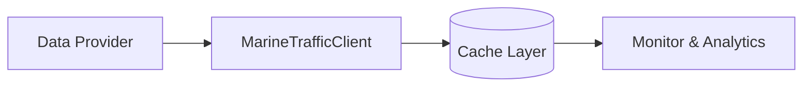

# Marine Traffic - Sistema di Monitoraggio Real-Time

Sistema avanzato di monitoraggio del traffico marittimo in tempo reale, con predizione degli arrivi e clustering operativo dei vettori. L'obiettivo del progetto è fornire una chiara visione dell'affluenza dei porti italiani con particolare attenzione all'Autorità Portuale del Tirreno Centrale.

## 🎯 Funzionalità Principali

- **Rilevamento Vettori**: Integrazione con piattaforma Marine Traffic e fonti AIS open-data configurabili per rilevare navi attive
- **Predizione Real-Time**: Calcolo predittivo degli arrivi con stima di confidenza
- **Clustering Operativo**: Raggruppamento intelligente dei vettori per:
  - Tipo di nave (Container, Tanker, Cargo, etc.)
  - Finestra temporale di arrivo
  - Dimensione della nave
  - Tempi operativi stimati
- **Analisi Capacità Portuale**: Valutazione dell'utilizzo degli ormeggi e rilevamento congestioni
- **Report Dettagliati**: Generazione automatica di report in formato JSON
- **Interfaccia Grafica**: Configurazione guidata della fonte dati (commerciale, open-source o simulata)
- **Proiezioni Serie Temporali**: Analisi delle finestre di arrivo future con trend stimato

## 🚢 Porti Monitorati

Il sistema è configurato per monitorare i principali porti del Tirreno Centrale:

- **Napoli** (Naples)
- **Salerno**
- **Civitavecchia**
- **Gaeta**

## 📋 Requisiti

- Python 3.8 o superiore
- Dipendenze specificate in `requirements.txt`

## 🔧 Installazione

1. **Clone del repository**:
```bash
git clone https://github.com/pietroscik/Marinetraffic.git
cd Marinetraffic
```

2. **Installazione delle dipendenze**:
```bash
pip install -r requirements.txt
```

3. **Configurazione**:
```bash
cp .env.template .env
# Modifica .env con la tua API key o credenziali open-data
```

Per utilizzare dati open-source è possibile impostare variabili aggiuntive (vedi sezione dedicata).

## 🚀 Utilizzo

### Esecuzione Base

```bash
python marine_traffic_monitor.py
```

All'avvio viene proposta un'interfaccia grafica (Tkinter) per scegliere la fonte
dati da utilizzare (API MarineTraffic, dataset open-source locale/HTTP o dati
simulati) e, opzionalmente, abilitare le proiezioni sulle serie temporali degli
arrivi. In ambienti server/headless è possibile disabilitare la GUI impostando
`MARINETRAFFIC_NO_GUI=1` o eseguendo lo script con la variabile d'ambiente
settata.

### Configurazione Personalizzata

Modifica il file `.env` basandoti sul template fornito:

```env
# Chiave API Marine Traffic (facoltativa con fonti open-data)
MARINETRAFFIC_API_KEY=your_api_key_here

# Forza la modalità dati: commercial | aishub | open_file | open_http | simulated
DATA_PROVIDER_MODE=

# Porti da monitorare (separati da virgola)
TARGET_PORTS=Naples,Salerno,Civitavecchia

# Fonte open-data locale (CSV/JSON/GeoJSON)
AIS_OPEN_DATA_FILE=data/ais_sample.json

# Endpoint open-data HTTP (alternativa al file)
AIS_OPEN_DATA_URL=https://meri.digitraffic.fi/api/ais/v1/locations/latest/

# Parametri opzionali per la richiesta HTTP (JSON)
AIS_OPEN_DATA_PARAMS={"type":"Cargo"}

# Header opzionali per la richiesta HTTP (JSON)
AIS_OPEN_DATA_HEADERS={"Accept":"application/json"}

# Nome del parametro query che rappresenta il porto
AIS_OPEN_DATA_PORT_PARAM=port

# Credenziali e parametri per il feed documentato da AISHub
AIS_HUB_USERNAME=
AIS_HUB_API_KEY=
AIS_HUB_OUTPUT=json
AIS_HUB_MESSAGE_FORMAT=1
AIS_HUB_COMPRESS=0
# Parametri extra JSON (es. lat/lon personalizzati se il porto non è in elenco)
AIS_HUB_EXTRA_PARAMS={}

# Abilita la GUI (default) o la disabilita per ambienti headless
MARINETRAFFIC_NO_GUI=0

# Abilita le proiezioni delle serie temporali
ENABLE_SERIES_PROJECTIONS=false

# Parametri per l'analisi delle serie temporali (se abilitata)
PROJECTION_HORIZON_HOURS=48
PROJECTION_INTERVAL_HOURS=6
```

#### Esempio configurazione MarineTraffic (commerciale)

```env
DATA_PROVIDER_MODE=commercial
MARINETRAFFIC_API_KEY=mt_live_xxxxxxxxxxxx
```

#### Esempio configurazione AISHub (open-data documentato)

```env
DATA_PROVIDER_MODE=aishub
AIS_HUB_USERNAME=your_username
AIS_HUB_API_KEY=optional_token
AIS_HUB_OUTPUT=json
AIS_HUB_MESSAGE_FORMAT=1
AIS_HUB_COMPRESS=0
AIS_HUB_EXTRA_PARAMS={
  "latmin": "40.10",
  "latmax": "40.90",
  "lonmin": "13.90",
  "lonmax": "14.70"
}
```

Le variabili `AIS_OPEN_DATA_*` e `AIS_HUB_*` sono facoltative e permettono di utilizzare fonti alternative gratuite o open-source in sostituzione (o come fallback) dell'API commerciale. In particolare, `AIS_HUB_USERNAME` e `AIS_HUB_API_KEY` consentono di interrogare il feed documentato su [aishub.net/api](https://www.aishub.net/api), mentre i parametri `AIS_HUB_OUTPUT`, `AIS_HUB_MESSAGE_FORMAT` e `AIS_HUB_COMPRESS` replicano le opzioni di formato illustrate dalla documentazione ufficiale. Se il porto non è presente nell'elenco interno (`data_providers.PORT_COORDINATES`) è possibile definire un bounding box personalizzato fornendo i campi `latmin`, `latmax`, `lonmin`, `lonmax` all'interno di `AIS_HUB_EXTRA_PARAMS`.

## 📊 Output

Il sistema genera:

1. **Output a Console**: Report dettagliato in tempo reale con:
   - Numero di vettori attivi per porto
   - Arrivi prioritari nelle prossime 12 ore
   - Percentuale di utilizzo del porto
   - Allerte per potenziali congestioni

2. **File JSON**: Report completo salvato in `data/marine_traffic_report_YYYYMMDD_HHMMSS.json`

### Esempio Output Console

```
================================================================================
SISTEMA DI MONITORAGGIO TRAFFICO MARITTIMO
Autorità Portuale Tirreno Centrale
================================================================================

Porti monitorati: Naples, Salerno, Civitavecchia
Data/Ora: 2024-01-15 14:30:00

================================================================================
MONITORAGGIO PORTO: Naples
================================================================================

[1/5] Recupero vettori attivi nell'area di Naples...
✓ Trovati 6 vettori attivi

[2/5] Calcolo predizioni di arrivo in tempo reale...
✓ Generate 6 predizioni
✓ Identificati 3 arrivi prioritari (prossime 12 ore)

[3/5] Clustering vettori per analisi operativa...
✓ Clustering completato
✓ Utilizzo porto: 60.0%

[4/5] Calcolo statistiche traffico portuale...
✓ Statistiche calcolate

[5/5] Generazione proiezioni serie temporali arrivi...
✓ Proiezioni generate su 48 ore (passo 6h)

================================================================================
REPORT RIASSUNTIVO
================================================================================

NAPLES:
  • Vettori attivi: 6
  • Arrivi prioritari (12h): 3
  • Utilizzo porto: 60.0%

  Prossimi arrivi:
    - MEDITERRANEAN STAR (Container Ship)
      ETA: 2.5 ore, Confidenza: 85%
    - OCEAN VOYAGER (Tanker)
      ETA: 5.8 ore, Confidenza: 80%

  Proiezioni arrivi (prime finestre):
    • 15/01 14:00 - 20:00: 2 arrivi previsti
    • 15/01 20:00 - 02:00: 3 arrivi previsti
  • Trend stimato: Trend crescente (slope 0.50)
```

## 🏗️ Architettura



Il sistema è composto da 4 moduli principali:

### 1. `marine_traffic_client.py`
Client per l'interazione con l'API di Marine Traffic:
- Recupero dati vettori in area portuale
- Statistiche sul traffico
- Dettagli specifici delle navi
- Integrazione nativa con provider open-data (file locali o endpoint HTTP)

### 2. `arrival_predictor.py`
Modulo di predizione arrivi:
- Calcolo ETA corretto basato su velocità e status
- Stima di confidenza della predizione
- Identificazione arrivi prioritari
- Calcolo finestre temporali di arrivo
- Generazione proiezioni serie temporali sugli arrivi

### 3. `vessel_clustering.py`
Sistema di clustering operativo:
- Raggruppamento per tipo di nave
- Clustering per finestra temporale
- Classificazione per dimensione
- Stima tempi operativi
- Analisi capacità portuale

### 4. `marine_traffic_monitor.py`
Applicazione principale:
- Orchestrazione dei moduli
- Generazione report
- Output formattato
- Salvataggio risultati

### 5. `monitor_gui.py`
Interfaccia grafica Tkinter per scegliere la fonte dati, configurare i porti da
monitorare e attivare le analisi di proiezione delle serie temporali.

Documentazione aggiuntiva è disponibile in `docs/REFERENCE.md` e
`docs/architecture.md`.

## 🧩 Schema Dati Nave

```json
{
  "mmsi": 247039300,
  "ship_name": "TEST VESSEL",
  "ship_type": "Cargo",
  "destination": "Naples",
  "eta": "2024-05-01T12:00:00",
  "speed": 12.5,
  "course": 90,
  "latitude": 40.83,
  "longitude": 14.25,
  "draught": 8.5,
  "length": 200,
  "width": 32,
  "status": "Under way using engine"
}
```

Ogni provider converte i payload nativi in questo schema uniforme tramite la
funzione `normalize_ais_record`.

## 📈 Metriche e KPI

Il sistema calcola automaticamente:

- **Numero vettori attivi** per porto
- **ETA medio** in ore
- **Distribuzione per tipo** di nave
- **Utilizzo porto** in percentuale
- **Tempi operativi stimati** per vettore
- **Finestre temporali** di arrivo
- **Allerte congestione** quando l'utilizzo supera la capacità

## 🔐 API Key

Per utilizzare il sistema con dati reali, è necessaria una API key di Marine Traffic:
- Registrati su [Marine Traffic](https://www.marinetraffic.com/)
- Ottieni la tua API key
- Configurala nel file `.env`

**Nota**: Il sistema include dati simulati per scopi dimostrativi e di testing.

## 🌐 Fonti dati alternative (Open Source / Free Access)

Per contesti in cui non è possibile utilizzare l'API proprietaria di Marine Traffic, il progetto supporta fonti alternative configurabili tramite le variabili `AIS_OPEN_DATA_*` e `AIS_HUB_*`. Alcuni esempi di dataset e servizi open-data:

- **AISHub** – Feed JSON documentato su [aishub.net/api](https://www.aishub.net/api); richiede registrazione gratuita e consente bounding box personalizzati tramite parametri `latmin/latmax/lonmin/lonmax`.
- **Traficom Digitraffic (Finlandia)** – Endpoint pubblico `https://meri.digitraffic.fi/api/ais/v1/locations/latest/` con dati AIS in tempo quasi reale (licenza CC BY 4.0).
- **NOAA Marine Cadastre (USA)** – Dataset storici AIS scaricabili gratuitamente in formato CSV/GeoJSON da [marinecadastre.gov](https://marinecadastre.gov/ais/).
- **European Marine Observation and Data Network (EMODnet)** – Strumenti e servizi per l'accesso a layer AIS aggregati europei.

È possibile combinare queste fonti con dati locali (CSV/JSON/GeoJSON) esportati da portali pubblici nazionali per alimentare il sistema senza costi di licenza.

## ✅ Test & CI

- `pytest` verifica i provider e la catena di fallback
- `python -m compileall .` garantisce la validità sintattica del codice
- Il workflow GitHub Actions `.github/workflows/tests.yml` esegue automaticamente entrambi i controlli su push e pull request

## 🌐 Skeleton API FastAPI

La cartella `api/` contiene uno scheletro FastAPI (`server.py`) con le rotte
`/vessels`, `/ports` e `/stats`. Attualmente restituiscono placeholder e
documentano le risposte attese: potranno essere collegate al sistema di cache o
ai provider live in evoluzioni successive.

## 🛠️ Sviluppo Futuro

Possibili miglioramenti:

- [ ] Integrazione con database per storico
- [ ] Dashboard web interattiva
- [ ] Notifiche push per arrivi critici
- [ ] Machine learning per miglioramento predizioni
- [ ] Integrazione con sistemi di gestione portuale
- [ ] API REST per accesso dati
- [ ] Visualizzazione mappa in tempo reale

## 📝 Licenza

Questo progetto è sviluppato per l'Autorità Portuale del Tirreno Centrale.

## 👥 Contributi

Per contribuire al progetto, aprire una issue o una pull request.

## 🙏 Credits

Data provided by AISHub (www.aishub.net).

## 📧 Contatti

Per informazioni: [GitHub Repository](https://github.com/pietroscik/Marinetraffic)
