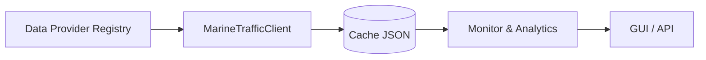

# Architettura del Sistema

1. **Provider** – Il registro dinamico `provider_registry` auto-rileva i moduli
   all'interno di `data_providers/` e istanzia il provider richiesto via
   `DATA_PROVIDER_MODE`.
2. **Client** – `MarineTrafficClient` coordina la catena di provider e gestisce
   la scrittura/lettura della cache.
3. **Cache** – I dati normalizzati vengono persistiti in `data/cache/` tramite
   helper JSON leggeri; il TTL è configurabile con la variabile
   `DATA_CACHE_TTL_MINUTES`.
4. **Analytics** – `MarineTrafficMonitor`, `ArrivalPredictor` e
   `VesselClusterer` elaborano i dati correnti fornendo report e proiezioni.
5. **GUI/API** – La GUI Tkinter permette la configurazione interattiva mentre lo
   scheletro FastAPI (`api/server.py`) consentirà future integrazioni.
